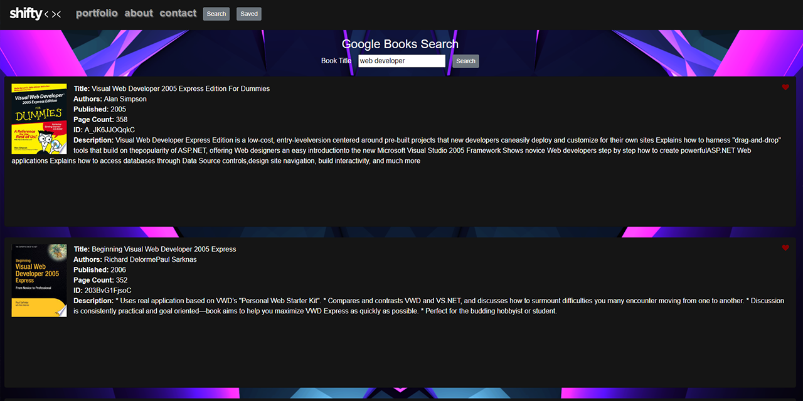

# Google Books Search

---

### Table of Contents

- [Description](#description)
- [How to Use](#how-to-use)
- [Installation](#installation)
- [Technologies](#technologies)
- [License](#license)
- [Contributors](#contributors)

---

### Description

Search for your favorite books and save them to a list to reference later when you're trying to find the next good book to read. Google Book Search utilizes Google Books API, and is built using React, Express, MongoDB, and Node.js.

---

### How to Use

1. [Open the application](https://shiftymitch-google-books.herokuapp.com/) in your browser.
2. Search for a book.
3. Save a book by clicking the heart Icon.
4. Click the Saved button in the nav bar to see your saved books.
5. Delete a book by clicking on the delete icon.

---

### Installation

Google Books Search is live [here](https://shiftymitch-google-books.herokuapp.com/)

---

### Technologies

[React](https://reactjs.org)\
[Express](https://expressjs.com/)\
[Mongoose](https://mongoosejs.com/)\
[MongoDB](https://www.mongodb.com/)\
[Node.js](https://nodejs.org/)

---

### License

MIT © [shiftymitch](https://github.com/shiftymitch)

---

### Contributors

| Developer | GitHub |
| ------ | ------ |
| Mitch Henderson | [shiftymitch](https://github.com/shiftymitch) |

[Back to the Top](#project-name)
